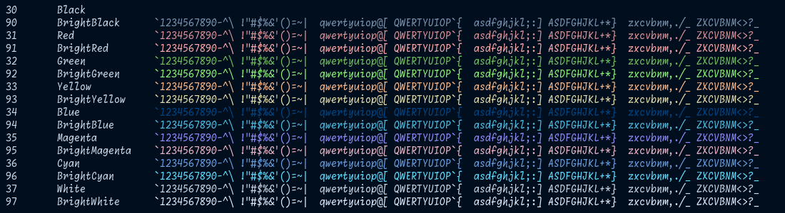

# Aquatermium.winterm ⌨️
##### Aquavium color scheme on Windows Terminal

## 📷️ プレビュー - Preview -
Preview is the same as the wezterm version. 
プレビューは、weztermと同じ物を使用しています。 

## 💼 依存関係 - Dependencies -
- [WezTerm](https:/wezterm.org/)

## 🔧 インストール - Install -
1. Windows Terminalを起動し、設定画面から`settings.json`を開きます。
2. `schemes`配列に、`scheme.json`内の内容を追加します。
3. 配色設定を`Aquatermium`に変更します。
 

1. Open Windows Terminal and open `settings.json`.
2. Add the contents of `scheme.json` to the `schemes` array.
3. Change the color scheme to `Aquatermium`.
